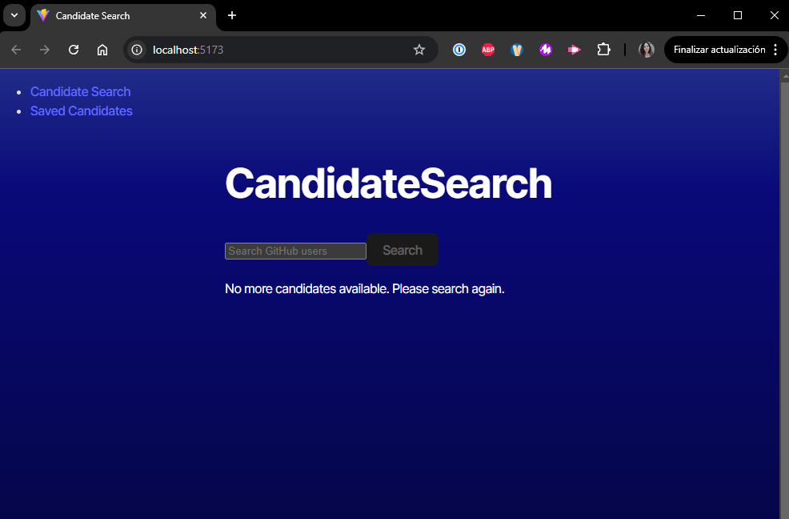

# Candidate Search Application

## Overview

The Candidate Search Application is designed to help employers search for potential candidates using data retrieved from the GitHub API. The application provides a seamless and user-friendly interface that allows employers to browse candidate profiles, save potential candidates for future reference, and manage candidate lists efficiently.



## Usage

View Candidate Information:

```md
Load the main page to see detailed information for a candidate fetched from the GitHub API.
Use the "+" button to save a candidate or the "-" button to skip.
```

View Saved Candidates:

```md
Navigate to the potential candidates page to see a list of all saved candidates.
Review the profile details of previously accepted candidates.
```

Persistent Storage:

```md
The application ensures that the list of saved candidates is maintained even after a page refresh.
```

## Features

```md
* Display detailed candidate information.
* Save potential candidates with a single click.
* Navigate through candidate profiles seamlessly.
* Persistent storage of accepted candidates.
* Interactive UI developed with TypeScript.
```

## Technologies Used

```md
* Front-end: TypeScript, React
* API: Pre-built server calling the GitHub API
* Deployment: Render platform for live hosting
```

## Installation

Clone the repository:

```md
git clone https://github.com/your-username/candidate-search-app.git
cd candidate-search-app
```

Install dependencies:

```md
npm install
```

Configure environment variables:

* Create a .env file at the root level if needed.
* Add the API base URL:

```md
REACT_APP_API_URL=your_api_base_url
```

Run the application locally:

```md
npm run dev
```

## Deployment
The project is deployed on Render. Access the live version at [Deployment URL].

## License

This project is licensed under the MIT License. See the [LICENSE](LICENSE) file for more details.


